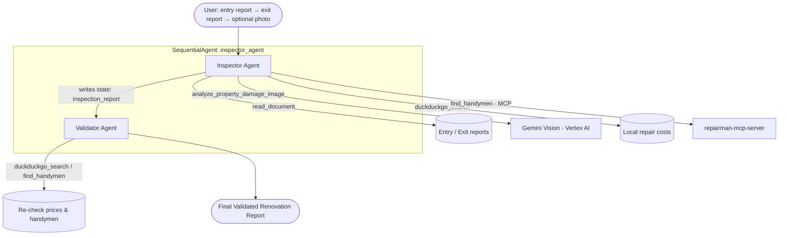

# inspector-agent

An AI-powered **property inspection & renovation-cost estimator** for rental properties, built as a multi-agent pipeline on the [Google Agent Development Kit (ADK)](https://adk.dev/).

---

## The Problem

When a tenant moves out of a rental property, the landlord or property manager has to:

1. Compare the **entry** inspection report (state at move-in) with the **exit** inspection report (state at move-out).
2. Identify damage, dirt, and alterations that go **beyond normal wear and tear**.
3. Estimate a realistic **repair/replacement cost** for each issue at *local* market rates.
4. Find **handymen/contractors** who can actually carry out the repairs.
5. Sanity-check the whole estimate so tenants aren't over- or under-charged.

Done by hand this is slow, subjective, and easy to get wrong — cost estimates drift from real market prices and it's hard to prove which damage is genuinely chargeable.

## The Solution

`inspector-agent` automates this end-to-end as a conversation. You hand it the entry report, then the exit report (and optionally a **photo** of the damage), and it produces a structured, **validated** renovation-cost report with matching handymen.

It is deliberately built as **two cooperating agents** so that the estimate is independently checked:

- An **Inspector Agent** does the comparison, cost research, and handyman lookup.
- A **Validator Agent** (acting as a real-estate expert) reviews the inspector's numbers, flags exaggerations, and adjusts anything unrealistic.

### Key capabilities

| Capability | How |
|---|---|
| Compare entry vs. exit state | LLM reasoning over both reports (`read_document`) |
| Damage-from-photo analysis | Gemini vision on Vertex AI (`analyze_property_damage_image`) |
| Local market cost estimates | Live web search (`duckduckgo_search`), scoped to the property's city |
| Handyman lookup | External `repairman-mcp-server` over MCP (`find_handymen`) |
| Independent cost validation | Second agent re-checks and adjusts every estimate |
| Location safeguard | Pipeline pauses and asks the user if the property city is missing |

---

## Architecture

The project is a `SequentialAgent` that runs two Gemini-powered sub-agents in order, passing state between them.



### 1. Inspector Agent (`inspector_agent`)

- **Role:** Drives the multi-turn conversation. On turn 1 it acknowledges the **entry** report and asks for the **exit** report. Once the exit report arrives it compares the two states, isolates damage beyond normal wear and tear, determines the property's location, estimates local repair costs, and looks up matching handymen.
- **Tools:** `read_document`, `duckduckgo_search`, `analyze_property_damage_image` (Vertex AI Gemini vision), and `find_handymen` (via the MCP toolset).
- **Guardrail:** If the city/location is not present in either report, it **stops and asks the user** before doing any cost research.
- **Output:** Writes the compiled inspection report to session state under the key `inspection_report`.

### 2. Validator Agent (`validator_agent`)

- **Role:** Acts as a real-estate expert. Reads `{inspection_report}` from state, checks that every repair cost is realistic, flags values that are too high or too low, and proposes adjusted costs with reasoning.
- **Tools:** `duckduckgo_search` (to verify market rates) and `find_handymen` (to verify/complete handyman details).
- **Output:** The final **Validation Report** with verified/adjusted costs and the corrected total renovation cost.

### Runtime & integrations

- **Model:** `gemini-3.5-flash` via a `CustomGemini` wrapper (API-key auth; returns deterministic canned responses under `pytest` / integration tests).
- **Vision:** `analyze_property_damage_image` calls Gemini on **Vertex AI** to describe damage in a photo and recommend a repair.
- **Handyman service:** `find_handymen(problem, location)` is served by a separate **[repairman-mcp-server](https://modelcontextprotocol.io/)** launched over stdio (see Requirements).
- **Serving:** A **FastAPI** backend (`fast_api_app.py`) exposes the agent, with **A2A (Agent2Agent)** endpoints attached (`app_utils/a2a.py`) so it's reachable by A2A clients and Gemini Enterprise.
- **Observability:** Built-in telemetry exports to Cloud Trace, BigQuery, and Cloud Logging (`app_utils/telemetry.py`).

---

## Project Structure

```
inspector-agent/
├── inspector_agent_app/          # Core agent package
│   ├── agent.py                  # Agents, tools, and SequentialAgent pipeline
│   ├── fast_api_app.py           # FastAPI backend server (+ A2A routes)
│   └── app_utils/
│       ├── vision.py             # Gemini vision damage analysis (Vertex AI)
│       ├── a2a.py                # A2A (Agent2Agent) endpoint wiring
│       ├── services.py           # Session/artifact/memory services
│       └── telemetry.py          # Cloud Trace / BigQuery / Logging exporters
├── entry_report.txt              # Sample entry inspection report
├── exit_report.txt               # Sample exit inspection report
├── tests/                        # Unit, integration, and eval suites
├── AGENTS.md                     # AI-assisted development guide
└── pyproject.toml                # Project dependencies
```

> 💡 **Tip:** Use [Antigravity CLI](https://antigravity.google/) for AI-assisted development — project context is pre-configured in `AGENTS.md`.

---

## Requirements

Before you begin, ensure you have:

- **uv** — Python package manager used for all dependency management ([install](https://docs.astral.sh/uv/getting-started/installation/); add packages with `uv add <package>`).
- **agents-cli** — the Agents CLI: `uv tool install google-agents-cli`.
- **Google Cloud SDK** — for Vertex AI (vision) and GCP services ([install](https://cloud.google.com/sdk/docs/install)).
- **repairman-mcp-server** — the external MCP server backing `find_handymen`, available at [ennovative-solutions/5dgai-inspector-agent-mcp-server](https://github.com/ennovative-solutions/5dgai-inspector-agent-mcp-server). `agent.py` launches it over stdio via `uv`; clone it locally and point `REPAIRMAN_MCP_SERVER_DIR` at your checkout:

  ```bash
  git clone https://github.com/ennovative-solutions/5dgai-inspector-agent-mcp-server.git
  ```

Set the following in `.env`:

- `GEMINI_API_KEY` — API key used by the `CustomGemini` model.
- `GOOGLE_CLOUD_PROJECT` / `GOOGLE_CLOUD_LOCATION` — used by the Vertex AI vision tool (auto-detected from `google.auth` when available).
- `REPAIRMAN_MCP_SERVER_DIR` — path to your local `repairman-mcp-server` checkout (defaults to `~/Development/repairman-mcp-server`).

---

## Quick Start

Install `agents-cli` and its skills if not already installed:

```bash
uvx google-agents-cli setup
```

Install required packages:

```bash
agents-cli install
```

Test the agent with a local web server:

```bash
agents-cli playground
```

You can also use features from the [ADK](https://adk.dev/) CLI with `uv run adk`.

### Try it

In the playground, follow the multi-turn flow:

1. Paste (or point to) the **entry** report, e.g. `entry_report.txt`. The inspector acknowledges it and asks for the exit report.
2. Provide the **exit** report, e.g. `exit_report.txt`. Optionally attach a photo of the damage.
3. If the property's city isn't in the reports, the agent will ask for it, then research local costs, find handymen, and the validator will return the final verified renovation report.

---

## Commands

| Command              | Description                                                                                 |
| -------------------- | ------------------------------------------------------------------------------------------- |
| `agents-cli install` | Install dependencies using uv                                                               |
| `agents-cli playground` | Launch local development environment                                                     |
| `agents-cli lint`    | Run code quality checks                                                                      |
| `agents-cli eval`    | Evaluate agent behavior (generate, grade, analyze, and more — see `agents-cli eval --help`) |
| `uv run pytest tests/unit tests/integration` | Run unit and integration tests                                      |

## 🛠️ Project Management

| Command | What It Does |
|---------|--------------|
| `agents-cli scaffold enhance` | Add CI/CD pipelines and Terraform infrastructure |
| `agents-cli infra cicd` | One-command setup of entire CI/CD pipeline + infrastructure |
| `agents-cli scaffold upgrade` | Auto-upgrade to latest version while preserving customizations |

---

## Development

Edit your agent logic in `inspector_agent_app/agent.py` and test with `agents-cli playground` — it auto-reloads on save.

## Deployment

```bash
gcloud config set project <your-project-id>
agents-cli deploy
```

To add CI/CD and Terraform, run `agents-cli scaffold enhance`.
To set up your production infrastructure, run `agents-cli infra cicd`.

## Observability

Built-in telemetry exports to Cloud Trace, BigQuery, and Cloud Logging.

## A2A Inspector

This agent supports the [A2A Protocol](https://a2a-protocol.org/). Use the [A2A Inspector](https://github.com/a2aproject/a2a-inspector) to test interoperability.
See the [A2A Inspector docs](https://github.com/a2aproject/a2a-inspector) for details.
